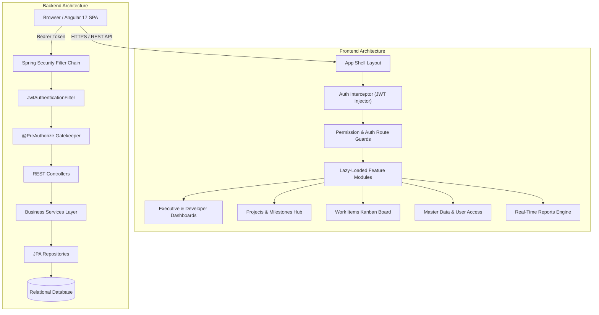

# TicketBoard Enterprise — Project Overview & Architecture Guide

> **Enterprise Project Delivery, Governance & Resource Management Workspace**  
> *Version 2.4.0 — Unified Full-Stack System Documentation*

---

## 📋 Table of Contents
1. [Executive Summary](#-executive-summary)
2. [Technology Stack](#-technology-stack)
3. [System Architecture](#-system-architecture)
4. [Core Functional Modules](#-core-functional-modules)
5. [Security & Authentication Model](#-security--authentication-model)
6. [Database & Data Models](#-database--data-models)
7. [API Endpoints Reference](#-api-endpoints-reference)
8. [Performance & Optimization Architecture](#-performance--optimization-architecture)
9. [Development Setup & Run Guide](#-development-setup--run-guide)

---

## 🚀 Executive Summary

**TicketBoard Enterprise** is an end-to-end, multi-tenant project delivery, governance, and resource capacity management platform designed for enterprise technology suites (e.g., Banking, Financial Services, and Large-Scale Software Delivery). 

It bridges the gap between executive portfolio reporting and developer-level work items by offering:
- **Real-Time Delivery Telemetry & Metrics** across projects, milestones, risks, and time tracking.
- **Role-Based Access Control (RBAC)** supporting granular permissions across Super Admins, Project Managers, Team Leads, Developers, and Clients.
- **Enterprise Reporting & Multi-Format Exports** (PDF, Excel, CSV, PPTX) with real-time data calculations.
- **Governance & Risk Management** for tracking project health, issues, and milestone gates (Dev, SIT, UAT, Go-Live).

---

## 🛠 Technology Stack

### Frontend Stack (Angular 17)
| Technology / Library | Version | Purpose |
| :--- | :--- | :--- |
| **Angular** | `17.x` | Core SPA Framework (Standalone Components, Signals) |
| **TypeScript** | `5.x` | Strictly typed application logic |
| **RxJS** | `7.8` | Reactive data streams & event handling |
| **Angular Material** | `17.x` | Form controls, dialogs, menus, and UI primitives |
| **Vanilla SASS / SCSS** | CSS3 | Custom high-density Slate design system |
| **ExcelJS** | `4.4` | Enterprise Excel export engine with custom formatting |
| **jsPDF & AutoTable** | `2.5` | Dynamic PDF report generation with branding |
| **PptxGenJS** | `3.12` | Executive presentation deck exports |

### Backend Stack (Spring Boot 3)
| Technology / Library | Version | Purpose |
| :--- | :--- | :--- |
| **Java** | `17 LTS` | Core programming language |
| **Spring Boot** | `3.2.x` | Backend micro-framework & REST APIs |
| **Spring Security** | `6.x` | Authentication, JWT, and Method-Level `@PreAuthorize` |
| **Spring Data JPA / Hibernate**| `6.x` | ORM, Repository abstraction & DB mapping |
| **Database (H2 / MySQL / PostgreSQL)** | Dynamic | Relational persistent database storage |
| **Lombok** | `1.18` | Boilerplate reduction for DTOs and Entities |
| **JJWT** | `0.11.5` | Stateless JSON Web Token authentication |

---

## 🏗 System Architecture



---

## 🧩 Core Functional Modules

### 1. Executive & Workspace Dashboards
- **Global Delivery Command Center**: Real-time stats on active teams, project managers, active projects, and monthly org capacity.
- **My Workspace**: Personalized developer view tracking assigned tasks, log hours, and urgent risks.

### 2. Project Management & Milestones
- **Project Catalog**: Filter projects by client, department, health (`GREEN`, `AMBER`, `RED`), and status.
- **Milestone Gates**: Track phase transitions (Dev, SIT, UAT, Go-Live) with progress indicators.
- **Project Detail Suite**: Integrated view of requirements, sprint work items, timelogs, and document attachments.

### 3. Work Items & Task Management
- **Interactive Board**: Kanban & List views for Tasks, Bugs, Improvements, and Change Requests (CRs).
- **Subtask & Issue Logger**: Track granular execution details with estimated vs. actual hours.

### 4. Master Data Management (MDM) & Global Governance
- **Global Picklists & Configurations**: Centralized management of task statuses, priority matrices, risk categories, and dropdown configurations.
- **Role & Permission Matrix**: Granular security mapping permissions (e.g., `workitem:create`, `project:edit`, `admin:master-data`) to enterprise roles.

### 5. Advanced Real-Time Reporting Engine
- **Dynamic Database Calculations**: Zero hardcoded data; reports dynamically summarize actual tasks, costs, and project health.
- **Multi-Format Export Engine**: Custom styled exports for PDF (branded headers, colorful tables), Excel (formula calculations, styled sheets), and PowerPoint decks.

---

## 🔒 Security & Authentication Model

1. **Stateless JWT Authentication**:
   - Secure login issues standard JWT Bearer token valid for configured session duration.
   - Externalized JWT Secret and DB password keys via environment fallback variables.

2. **Backend Protection (`@PreAuthorize`)**:
   - All REST API endpoints are guarded with fine-grained security authorities:
     - `@PreAuthorize("hasAuthority('project:view')")`
     - `@PreAuthorize("hasAuthority('admin:access')")`

3. **Frontend Permission Guard (`permissionGuard`)**:
   - Lazy-loaded routes verify user permissions before route activation.
   - Unauthorized attempts automatically redirect to a dedicated `403 Access Denied` view.

---

## 🗄 Database & Data Models

### Entity Relationship Model Overview
- **User**: User credentials, status (`ACTIVE`, `INACTIVE`), and mapped `Role` entities.
- **Role**: Associated with set of string `Permission` authorities.
- **Project**: Contains project metadata, health indicator, client info, budget, and mapped `Milestone` records.
- **WorkItem**: Linked to `Project`, `User` (Assignee & Reporter), containing priority, status, estimated/actual hours.
- **TimeEntry**: Logs work dates, hours spent, and description linked to a specific `WorkItem` and `User`.

---

## 🌐 API Endpoints Reference

### Auth & User Access
- `POST /api/auth/login` — Authenticate user and return JWT
- `POST /api/auth/register` — Register user (Defaults to `ROLE_DEVELOPER`)
- `GET /api/users` — List enterprise users (Filtered by role/status)

### Projects & Delivery
- `GET /api/projects` — Fetch project catalog
- `POST /api/projects` — Create project
- `GET /api/projects/{id}` — Fetch detailed project view

### Work Items & Tasks
- `GET /api/work-items` — Search and filter tasks
- `POST /api/work-items` — Create new task/bug/CR
- `PUT /api/work-items/{id}` — Update task details or board column status

### Reports & Analytics
- `GET /api/dashboard/executive` — Summary telemetry for executive dashboard
- `GET /api/reports/generate` — Dynamic report data aggregation

---

## ⚡ Performance & Optimization Architecture

- **Lazy Loading Strategy**: 17+ feature routes converted from eager loading to Angular `loadComponent` lazy loading, reducing initial bundle size to under ~360 kB.
- **Database Query Indexing**: Key entities (`work_items`, `time_entries`, `projects`) indexed on foreign keys (`project_id`, `assignee_id`, `status`) to avoid table scans.
- **JPA Fetch Optimization**: Reduced unnecessary `EAGER` fetches to `LAZY` on `User.roles` and `Role.permissions` to eliminate N+1 query bottlenecks.
- **Reactive Subscription Safety**: Enforced Angular `DestroyRef` and `takeUntilDestroyed()` across components to prevent memory leaks.

---

## 💻 Development Setup & Run Guide

### Prerequisites
- **Node.js**: `v18.x` or higher
- **JDK**: `17` or higher
- **Maven**: `3.8+` (or bundled `./mvnw`)

### 1. Running Frontend (Angular)
```bash
cd ticketboard-frontend
npm install
npm start
```
*Application runs at:* `http://localhost:4200`

### 2. Running Backend (Spring Boot)
```bash
cd ticketboard-backend
./mvnw spring-boot:run
```
*Backend REST API runs at:* `http://localhost:8080`

---
*Documentation generated for TicketBoard Enterprise Workspace.*
